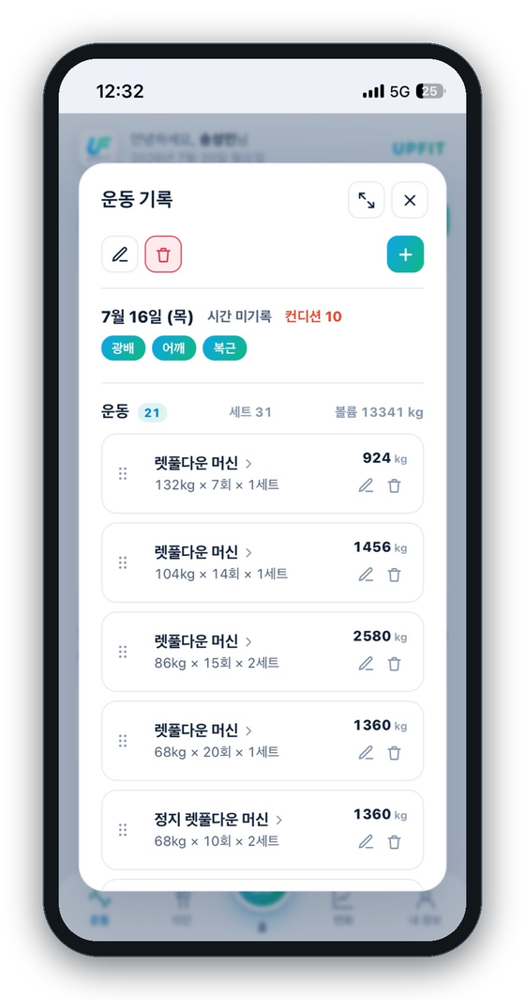
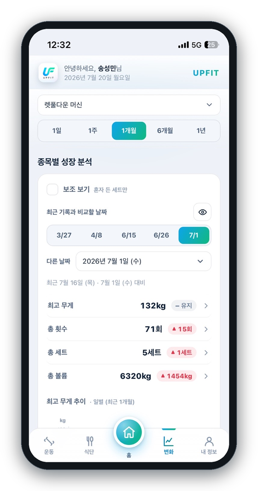
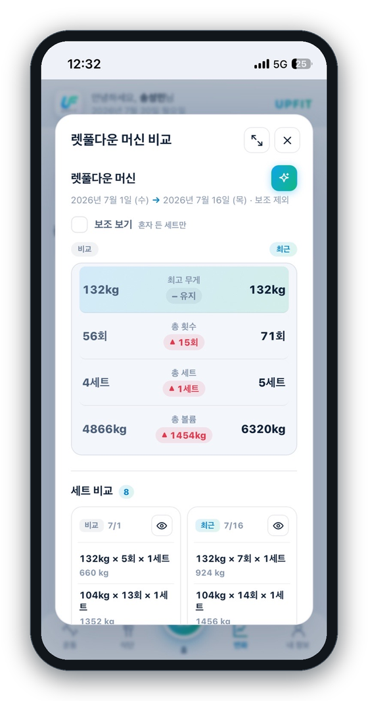

 

 

## 🏋️ 오늘의 운동, 흘려보내지 마세요

> 열심히 운동은 하는데, **정말 성장하고 있는지** 확신이 서지 않으셨나요?

어제보다 무거워졌는지, 지난달보다 볼륨이 늘었는지, 그 하락이 근손실인지 아니면 그냥 컨디션 문제인지 —
머릿속으로만 가늠하기엔 운동 기록은 너무 쉽게 흩어집니다.

**UpFit** 은 매 세트를 가볍게 기록하고, 그 기록이 **성장 곡선**이 되어 돌아오는 운동 노트입니다.
종목별로 무게·횟수·볼륨의 변화를 한눈에 보고, AI 코치가 추세를 읽어 다음 훈련의 방향까지 짚어줍니다.

이제 감이 아니라 **데이터로** 근성장을 증명하세요. 💪

 

## 📱 앱 미리보기

| 운동 기록 | 성장 분석 | 기록 비교 |
| :---: | :---: | :---: |
|  |  |  |
| 하루의 모든 세트를 부위·컨디션과 함께 정리 | 종목별 무게·볼륨 추세를 기간별 그래프로 확인 | 두 시점을 나란히 놓고 세트 단위까지 비교 |

 

## ✨ 이런 것들을 할 수 있어요

### 📝 가볍게 기록하고, 깔끔하게 정리돼요
하루 운동을 **세션 단위**로 담고, 각 종목의 무게·횟수·세트를 기록합니다.
가슴·등·어깨 같은 **운동 부위**와 그날의 **컨디션**까지 함께 남겨, 나중에 돌아봤을 때 맥락이 살아 있어요.
운동한 날의 총 운동 수·세트·볼륨이 자동으로 합산됩니다.

### 📈 종목별 성장 분석
종목 하나를 고르면 **최고 무게 · 총 횟수 · 총 세트 · 총 볼륨**의 흐름이 그래프로 그려집니다.
`1일 / 1주 / 1개월 / 6개월 / 1년` 기간을 바꿔가며, 지금 우상향 중인지 정체인지 바로 확인할 수 있어요.
파트너의 도움을 받은 **보조 세트**는 껐다 켜며 "혼자 든 기록"만 따로 볼 수도 있습니다.

### 🔍 두 시점 비교
과거의 어느 날과 최근 기록을 **나란히 펼쳐** 무엇이 얼마나 늘었는지 확인합니다.
지표별 증감은 물론, 그날 수행한 **세트 목록까지** 좌우로 비교돼요.
lbs로 기록한 종목은 입력한 그대로 lbs로 보여집니다.

### 🤖 AI 성장 분석
버튼 하나면 AI 코치가 그 종목의 **전체 기록**을 읽고 분석해 줍니다.

- 전반적으로 **상승 추세인지 하락 추세인지**
- 잠깐 꺾인 게 **근손실인지, 아니면 회복이 덜 된 일시적 하락인지**
- 성장이 실력 향상인지, 그날 **컨디션이 좋았던 것인지**
- 앞으로 **어떻게 하면 어떻게 되는지** 다음 훈련 방향까지

lbs로 기록한 종목은 분석도 lbs 기준으로 이야기해 줘요.

### 🗓️ 달력으로 한눈에
운동한 날이 달력에 표시되고, 그 달의 **운동일 / 휴식일 개수**가 함께 집계됩니다.
`○○○○년 ○월`을 눌러 원하는 년·월로 바로 이동할 수 있어요.

### 🌗 취향에 맞는 화면
**다크 모드 / 라이트 모드**를 지원하고, 리마인더 알림도 설정할 수 있습니다.
휴대폰 화면에 딱 맞춰 설계된 **모바일 우선** 디자인이에요.

 

## 📲 앱으로 설치하기 (PWA)

UpFit은 **웹 주소로 접속**해서 홈 화면에 추가하면, 별도 스토어 없이 앱처럼 쓸 수 있어요.
설치하면 전체 화면으로 실행되고, 홈 화면 아이콘·알림까지 앱과 똑같이 동작합니다.

### 🍎 iPhone · iPad (Safari)
1. **Safari** 로 UpFit 주소에 접속합니다.
2. 하단 가운데 **공유 버튼**( 네모에서 화살표가 위로 나가는 아이콘 )을 누릅니다.
3. 메뉴를 내려 **［홈 화면에 추가］** 를 선택합니다.
4. 오른쪽 위 **［추가］** 를 누르면 홈 화면에 UpFit 아이콘이 생겨요.

> 💡 iPhone에서는 반드시 **Safari** 로 설치해야 합니다. (Chrome 등 다른 브라우저에서는 홈 화면 추가가 보이지 않을 수 있어요.)

### 🤖 Android (Chrome)
1. **Chrome** 으로 UpFit 주소에 접속합니다.
2. 화면에 뜨는 **［앱 설치］／［홈 화면에 추가］** 안내를 누릅니다.
   - 안내가 안 보이면, 오른쪽 위 **⋮ 메뉴 → ［앱 설치］** 를 선택하세요.
3. **［설치］** 를 누르면 앱 서랍과 홈 화면에 UpFit이 추가됩니다.

설치 후에는 다른 앱들처럼 **아이콘을 눌러 바로 실행**하면 됩니다. ✨

 

## 🔐 로그인

카카오 · 네이버 · 구글 계정으로 **간편하게 로그인**할 수 있어요.
기록은 계정에 안전하게 저장되어, 기기를 바꿔도 그대로 이어집니다.

 

**UpFit 과 함께, 오늘의 한 세트가 내일의 성장이 됩니다.** 🔥

Made with 💙 for everyone who lifts.

