

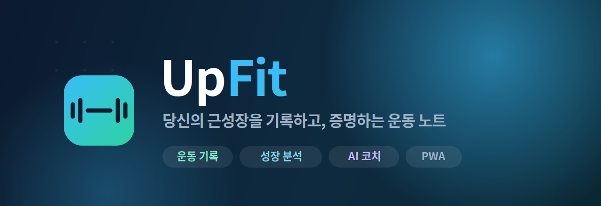

  

 

## 🏋️ 오늘의 운동, 흘려보내지 마세요

> 열심히 운동은 하는데, **정말 성장하고 있는지** 확신이 서지 않으셨나요?

어제보다 무거워졌는지, 지난달보다 볼륨이 늘었는지, 그 하락이 근손실인지 아니면 그냥 컨디션 문제인지 —
머릿속으로만 가늠하기엔 운동 기록은 너무 쉽게 흩어집니다.

**UpFit** 은 매 세트를 가볍게 기록하고, 그 기록이 **성장 곡선**이 되어 돌아오는 운동 노트입니다.
종목별로 무게·횟수·볼륨의 변화를 한눈에 보고, AI 코치가 추세를 읽어 다음 훈련의 방향까지 짚어줍니다.

이제 감이 아니라 **데이터로** 근성장을 증명하세요. 💪

 

<h3>한눈에 보는 UpFit</h3>

<table>
<tr>
<td align="center">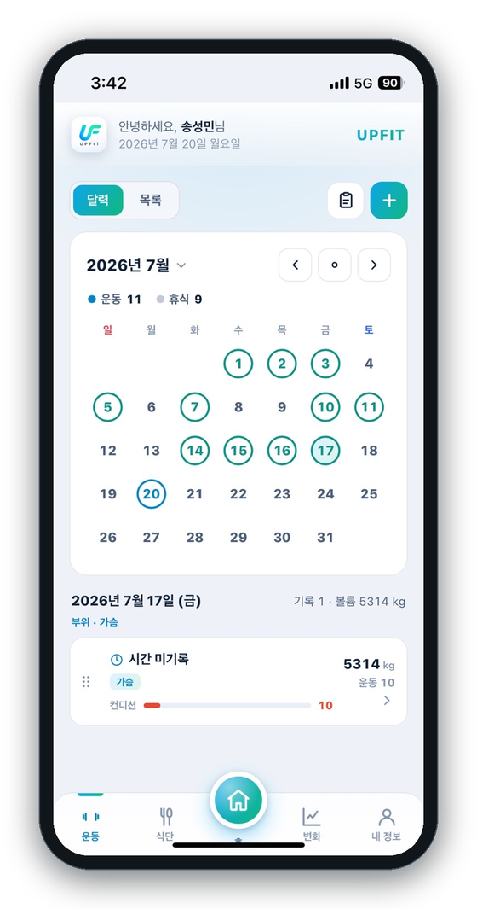 <b>홈 · 달력</b> 이 달의 운동일·휴식일과 하루 요약을 한 화면에</td>
<td align="center">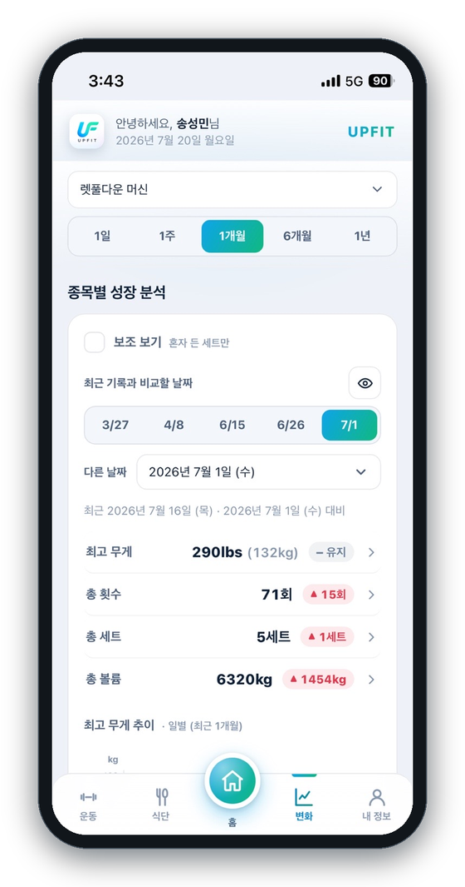 <b>성장 분석</b> 종목별 지표 변화를 기간별로 확인</td>
<td align="center">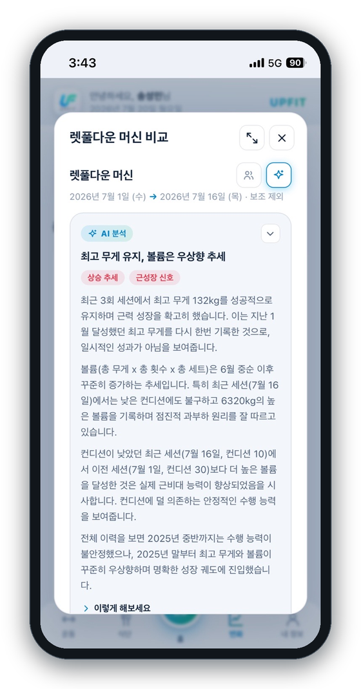 <b>AI 코치</b> 전체 기록을 읽고 추세와 방향을 해석</td>
</tr>
</table>

 

## ✨ 이런 것들을 할 수 있어요

 

<table>
<tr>
<td width="60%" valign="top">
<h3>📝 가볍게 기록하고, 깔끔하게 정리돼요</h3>

하루 운동을 <b>세션 단위</b>로 담고, 각 종목의 무게·횟수·세트를 기록합니다. 가슴·등·어깨 같은 <b>운동 부위</b>와 그날의 <b>컨디션(0~100)</b>, 시작·종료 시간까지 함께 남겨 나중에 돌아봤을 때 맥락이 살아 있어요.

운동한 날의 <b>총 운동 수 · 세트 · 볼륨</b>이 자동으로 합산되고, 맨몸 운동은 <code>맨몸</code>, lbs로 넣은 무게는 입력 그대로 표시됩니다.

</td>
<td width="40%" align="center">
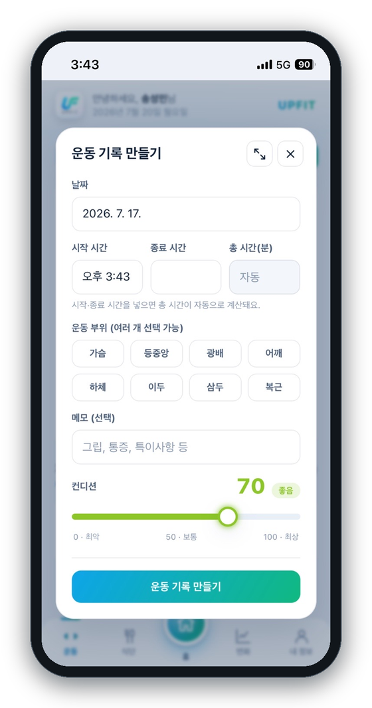
</td>
</tr>

<tr>
<td width="40%" align="center">
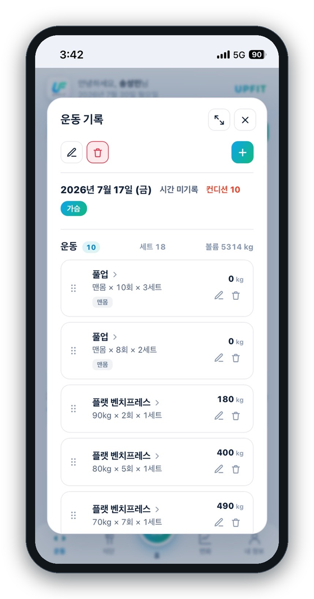
</td>
<td width="60%" valign="top">
<h3>📋 하루의 모든 세트를 또렷하게</h3>

그날 수행한 모든 종목이 순서대로 정리됩니다. 각 카드에서 <b>무게 × 횟수 × 세트</b>와 볼륨을 바로 확인하고, 드래그로 순서를 바꾸거나 즉시 수정·삭제할 수 있어요.

종목 이름을 누르면 그 종목의 <b>성장 분석</b>으로 곧바로 이동합니다.

</td>
</tr>

<tr>
<td width="60%" valign="top">
<h3>📈 종목별 성장 분석</h3>

종목 하나를 고르면 <b>최고 무게 · 총 횟수 · 총 세트 · 총 볼륨</b>의 흐름이 그래프로 그려집니다. <code>1일 / 1주 / 1개월 / 6개월 / 1년</code> 기간을 바꿔가며 지금 우상향 중인지 정체인지 바로 확인할 수 있어요.

과거의 어느 날을 골라 <b>최근 기록과 비교</b>하면 무엇이 얼마나 늘었는지 한눈에 보이고, 파트너의 도움을 받은 <b>보조 세트</b>는 껐다 켜며 "혼자 든 기록"만 따로 볼 수 있습니다.

</td>
<td width="40%" align="center">
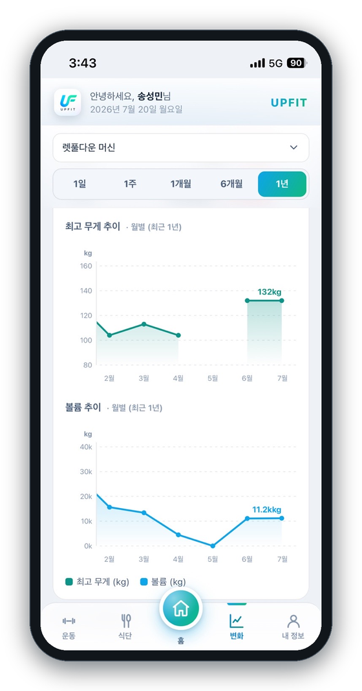
</td>
</tr>

<tr>
<td width="40%" align="center">
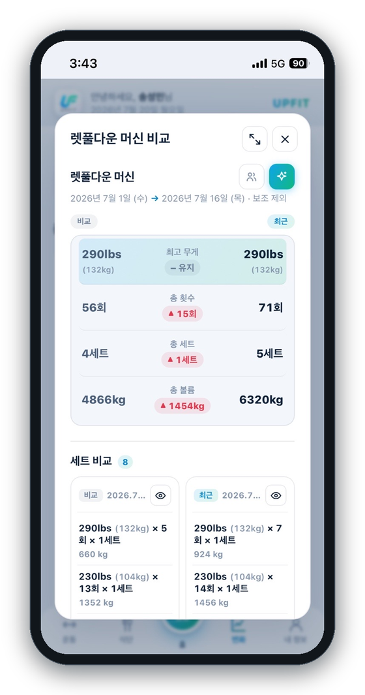
</td>
<td width="60%" valign="top">
<h3>🔍 두 시점을 나란히 비교</h3>

과거의 어느 날과 최근 기록을 <b>좌우로 펼쳐</b> 비교합니다. 지표별 증감은 물론, 그날 수행한 <b>세트 목록까지</b> 하나하나 대조돼요.

lbs로 기록한 종목은 <code>290lbs (132kg)</code>처럼 <b>입력한 단위 그대로</b> 보여줍니다.

</td>
</tr>

<tr>
<td width="60%" valign="top">
<h3>🤖 AI 성장 분석</h3>

버튼 하나면 AI 코치가 그 종목의 <b>전체 기록</b>을 읽고 분석해 줍니다.

<ul>
<li>전반적으로 <b>상승 추세인지 하락 추세인지</b></li>
<li>잠깐 꺾인 게 <b>근손실인지, 회복이 덜 된 일시적 하락인지</b></li>
<li>성장이 실력 향상인지, 그날 <b>컨디션이 좋았던 것인지</b></li>
<li>앞으로 <b>어떻게 하면 어떻게 되는지</b> 다음 훈련 방향까지</li>
</ul>

lbs로 기록한 종목은 분석도 <b>lbs 기준</b>으로 이야기해 줘요.

</td>
<td width="40%" align="center">

</td>
</tr>

<tr>
<td width="40%" align="center">
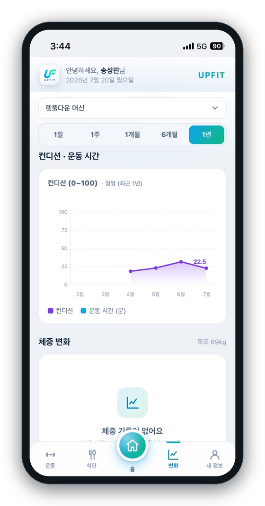
</td>
<td width="60%" valign="top">
<h3>📊 컨디션과 몸의 변화까지</h3>

운동 지표뿐 아니라 <b>컨디션 · 운동 시간 · 체중</b>의 흐름도 그래프로 볼 수 있어요. 목표 체중을 정해두고 변화를 따라가며, 컨디션이 성과에 어떤 영향을 줬는지 함께 살필 수 있습니다.

</td>
</tr>

<tr>
<td width="60%" valign="top">
<h3>🗓️ 달력과 목록, 원하는 방식으로</h3>

<b>달력</b>에는 운동한 날이 표시되고, 그 달의 <b>운동일 / 휴식일 개수</b>가 함께 집계돼요. <code>○○○○년 ○월</code>을 눌러 원하는 년·월로 바로 이동할 수 있습니다.

날짜순으로 쭉 훑고 싶을 땐 <b>목록 보기</b>로 전환하면 각 날짜의 부위·볼륨·컨디션이 카드로 이어집니다.

</td>
<td width="40%" align="center">
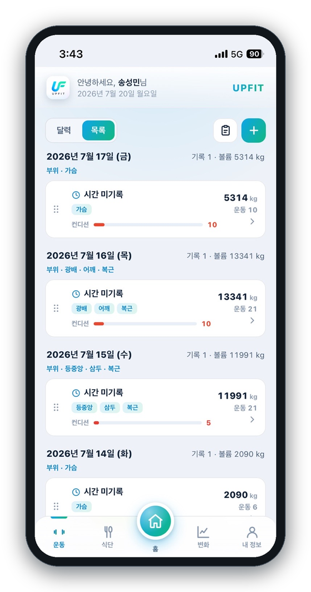
</td>
</tr>

<tr>
<td width="40%" align="center">
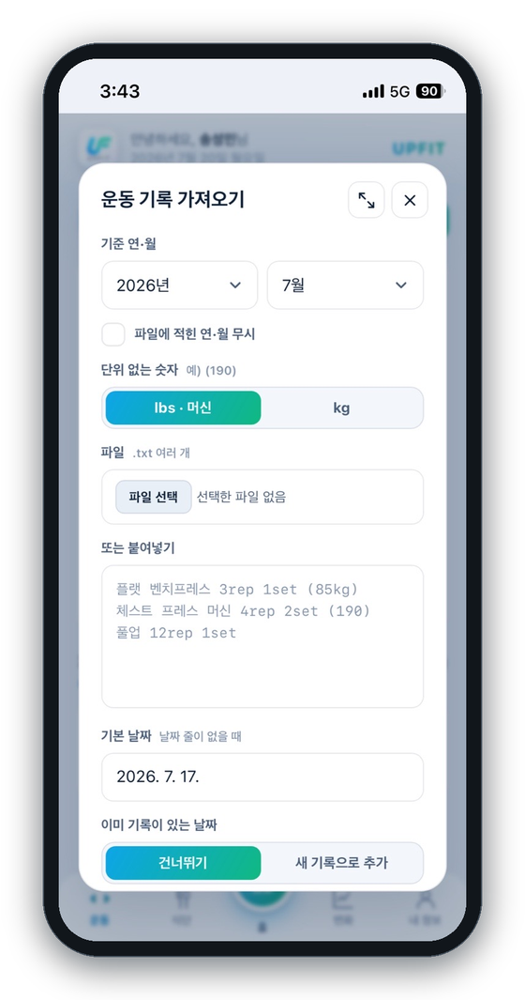
</td>
<td width="60%" valign="top">
<h3>⚡ 기록을 한 번에 가져오기</h3>

메모장이나 다른 앱에 적어둔 운동 기록이 있다면, <b>텍스트로 붙여넣기</b> 하거나 파일로 한꺼번에 가져올 수 있어요.

<pre><code>플랫 벤치프레스 3rep 1set (85kg)
체스트 프레스 머신 4rep 2set (190)
풀업 12rep 1set</code></pre>

이렇게 적어두기만 하면 날짜·종목·무게·횟수를 알아서 정리해 줍니다. 단위 없는 숫자를 <b>lbs로 볼지 kg로 볼지</b>도 고를 수 있어요.

</td>
</tr>
</table>

 

## 🌗 취향에 맞는 화면

**다크 모드 / 라이트 모드** 를 지원하고, 리마인더 알림도 설정할 수 있어요.
휴대폰 화면에 딱 맞춰 설계된 **모바일 우선** 디자인입니다.

 

## 📲 앱으로 설치하기 (PWA)

UpFit은 **웹 주소로 접속**해서 홈 화면에 추가하면, 별도 스토어 없이 앱처럼 쓸 수 있어요.
설치하면 전체 화면으로 실행되고, 홈 화면 아이콘·알림까지 앱과 똑같이 동작합니다.

<table>
<tr>
<td width="50%" valign="top">
<h3>🍎 iPhone · iPad (Safari)</h3>
<ol>
<li><b>Safari</b> 로 UpFit 주소에 접속합니다.</li>
<li>하단 가운데 <b>공유 버튼</b>(네모에서 화살표가 위로 ⬆️)을 누릅니다.</li>
<li>메뉴를 내려 <b>［홈 화면에 추가］</b>를 선택합니다.</li>
<li>오른쪽 위 <b>［추가］</b>를 누르면 완료!</li>
</ol>
<blockquote>💡 iPhone에서는 반드시 <b>Safari</b>로 설치해야 해요.</blockquote>
</td>
<td width="50%" valign="top">
<h3>🤖 Android (Chrome)</h3>
<ol>
<li><b>Chrome</b> 으로 UpFit 주소에 접속합니다.</li>
<li>화면에 뜨는 <b>［앱 설치 / 홈 화면에 추가］</b>를 누릅니다.</li>
<li>안내가 없으면 <b>⋮ 메뉴 → ［앱 설치］</b>를 선택합니다.</li>
<li><b>［설치］</b>를 누르면 완료!</li>
</ol>
<blockquote>💡 설치 후엔 아이콘을 눌러 바로 실행돼요.</blockquote>
</td>
</tr>
</table>

 

## 🔐 로그인

카카오 · 네이버 · 구글 계정으로 **간편하게 로그인**할 수 있어요.
기록은 계정에 안전하게 저장되어, 기기를 바꿔도 그대로 이어집니다.

 

<h3>UpFit 과 함께, 오늘의 한 세트가 내일의 성장이 됩니다. 🔥</h3>

Made with 💙 for everyone who lifts.

